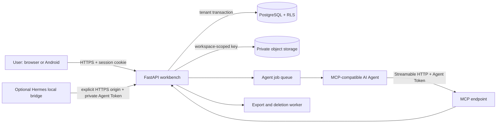

# Architecture

AI Agent Personal Workbench is a self-hosted FastAPI, React, PostgreSQL, and Android system. It turns durable user-owned records into a shared operating surface for a person and their MCP-compatible AI Agent.

## Trust boundaries

- Browser sessions and Agent Tokens are separate credentials. A token contains only a public workspace routing ID and a random secret; the database stores a peppered digest.
- Every tenant-owned table has `workspace_id`. PostgreSQL row-level security is enabled and forced, and each transaction sets `app.current_workspace_id` before tenant data access.
- Attachments are normalized, stored outside the image, keyed by workspace, and never served as a public filesystem.
- The first administrator is created only when the users table is empty. A PostgreSQL advisory transaction lock prevents concurrent first-run requests from creating multiple administrators.
- Registration invitations are one-time, expiring, hashed credentials. Each user owns a separate workspace.
- User and Agent writes use the same repositories, validation, audit records, and workspace event stream.
- The optional Hermes bridge runs in the user's local profile, uploads only explicitly authorized chat attachments, and is not part of the server image or repository state.

## Runtime components

| Component | Responsibility |
| --- | --- |
| `workbench` | HTTP API, React assets, sessions, user operations, WebSocket events, MCP endpoint |
| `worker` | Agent jobs, exports, account deletion, and asynchronous cleanup |
| `postgres` | Durable records, row-level isolation, invitations, credential digests, audit events |
| `private-objects` | Images and generated export artifacts, isolated from the container image |
| `caddy` | Optional public HTTPS termination and security headers |
| Android app | Trusted WebView shell, external-link routing, notifications while alive, server selection |

## Data lifecycle

Program images, database data, and private objects use separate volumes. Upgrading an image does not replace user data. A user can correct records, soft-delete supported entities, export their workspace, and request complete account deletion. Operators must back up PostgreSQL and private objects together so references remain consistent.

## MCP model

The MCP endpoint is `/mcp/` and uses Streamable HTTP. The server authenticates `Authorization: Bearer <Agent Token>` before exposing workspace tools. Tool calls cannot select an arbitrary workspace: the credential determines the only workspace the request may access.

Internal database values retained for compatibility may still use `hermes` in status/source fields. They are implementation details, not a private protocol requirement.

## Repository map

- `backend/app/cloud/`: multi-tenant HTTP API, authentication, repositories, MCP server, storage, and jobs.
- `backend/migrations/`: Alembic schema, grants, RLS policies, and upgrade path.
- `frontend/src/`: React user interface and API client.
- `mobile/`: Android WebView shell.
- `deploy/`: Caddy, PostgreSQL role bootstrap, backup timer, and smoke tests.
- `docs/`: operator, privacy, integration, and platform guidance.
- `.github/`: CI, release automation, and community templates.
- `hermes/` and `scripts/install_hermes_*`: optional persistent Hermes skill and local attachment/job bridge.
