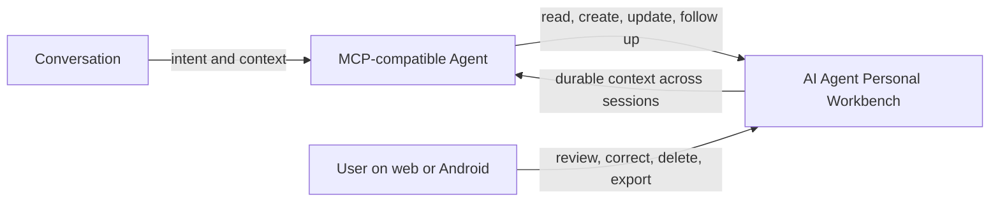
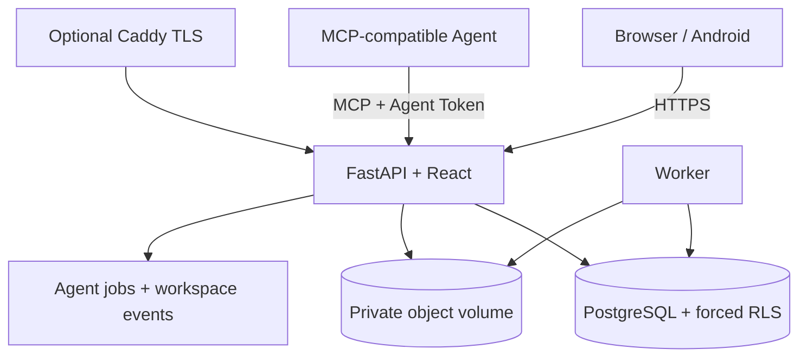

<div align="center">
  
  <h1>AI Agent Personal Workbench</h1>
  <p><strong>Your life doesn’t reset when a chat ends. Your agent shouldn’t either.</strong></p>
  <p>Let your agent remember every step you’ve taken — and help you take the next one.</p>
  <p><a href="README.zh-CN.md">简体中文</a> · Self-hosted · User-owned · MCP-native · Apache-2.0</p>
</div>

AI Agent Personal Workbench is the long-term record, action system, and user-visible control panel shared by a person and their AI Agent. It lets an authorized Agent do more than chat: it can remember, analyze, and keep taking action for the user. Tasks, learning, health, finance, media, and growth scattered across chats, devices, and sessions become durable records that the user can see, correct, delete, and export. Any compatible Agent can keep reading and updating that workspace through MCP.


> The walkthrough uses a fictional user and synthetic data. No public demo points at a real deployment.

First-time Chinese readers can follow the unified [Chinese installation and user guide](docs/USER_GUIDE.zh-CN.md), covering local use, phones, generic Agents, Hermes, HTTPS deployment, backup, and troubleshooting.

## Three-minute quick start

Requirements: Docker Engine with Compose v2 and Python 3.10+ for generating local secrets.

```bash
git clone https://github.com/theonlymoon919/ai-agent-personal-workbench.git
cd ai-agent-personal-workbench
python scripts/generate_env.py
docker compose up -d --build
```

Open [http://localhost:8787](http://localhost:8787). Because the database is empty, AI Agent Personal Workbench shows its one-time administrator setup. Choose your own username, display name, and password. The setup route closes permanently after success.

From **Me → Account & AI Agent**, the administrator can create a one-time invitation for another user. Every user can generate their own Agent Token and copy the MCP endpoint shown beside it.

For the downloadable alpha, start from [GitHub Releases](https://github.com/theonlymoon919/ai-agent-personal-workbench/releases) and the [Chinese release installation guide](docs/RELEASE_INSTALL.zh-CN.md). For a prebuilt GHCR image or an Ubuntu HTTPS installation, see [Deployment](docs/deployment.md).

## Connect an AI Agent

AI Agent Personal Workbench exposes standard MCP Streamable HTTP at:

```text
https://workbench.example.com/mcp/
Authorization: Bearer <the user's one-time-displayed Agent Token>
```

The token selects exactly one workspace; tools cannot switch tenants by passing another user ID. Configure the token in your Agent's secret store or environment, never in source code or chat history. See [Agent integration](docs/agent-integration.md) and the [Hermes reference integration](docs/integrations/hermes.md).

## Why ordinary Agent memory is not enough

Chat memory is usually invisible, difficult to correct, tied to one provider or conversation, and poor at durable actions. A person needs a record they control: one that survives a new chat, exposes what the Agent wrote, lets the person fix mistakes, and can be exported or deleted without asking the Agent.

AI Agent Personal Workbench makes that relationship explicit:



## What this enables

- Tell an Agent about a meal or workout in chat; it stores the health record and follows up later.
- Ask for a study goal; the Agent creates a staged learning plan with tasks and resources.
- Start a new conversation and continue from the same tasks, plans, and prior results.
- Correct an Agent-created record from a phone or desktop without editing hidden memory.
- Track projects, Chinese calendar annotations, health history, finances, trends, books, films, documentaries, short-video topics, and personalized daily news in one private workspace.

## Current capabilities

- Tasks, projects, phases, quadrants, recurring items, and year/month/week/day calendar views.
- Health goals, weight, water, meals, exercise images, per-record analysis, daily summaries, long-range charts, filtering, pagination, recycle bin, and restore.
- Learning plans with edit/delete/restore, lessons, resources, progress, books, films, documentaries, discussion, and organized notes.
- Finance accounts, categories, income, expenses, transfers, refunds, budgets, savings goals, recurring rules, summaries, archives, advice, soft deletion, and restore.
- Personal-IP topic preferences, short-video and AI/technology content with source links and media metadata.
- Invite-only multi-user registration, password/username change, Agent Token rotation, export, and complete account deletion.
- MCP tools, Agent job queue, audit events, WebSocket refresh, private object storage, PostgreSQL RLS, Android shell, and encrypted backup workflow.
- Optional Hermes reference installer with a persistent chat skill, attachment-path handoff, idempotent health-image upload bridge, and stable background connector.

## Privacy and tenant isolation

Each account owns one workspace. PostgreSQL row-level security is enabled and forced on tenant tables, the application sets tenant context per transaction, private objects use workspace-scoped keys, and a credential cannot request another workspace. Passwords use Argon2; session cookies and Agent Tokens are distinct; token secrets are stored only as peppered digests.

Program images, PostgreSQL data, private objects, and Caddy state use separate volumes. See [Privacy and security](docs/privacy-and-security.md) for the threat model, operator responsibilities, backup pairing, export, deletion, and incident handling.

## Architecture



Read [ARCHITECTURE.md](ARCHITECTURE.md) for trust boundaries, runtime components, and the repository map.

## Deployment and operations

- [Chinese installation and user guide](docs/USER_GUIDE.zh-CN.md)
- [Quick start](docs/quick-start.md)
- [Linux, HTTPS, source builds, and GHCR images](docs/deployment.md)
- [Backup, export, and recovery](docs/deployment.md#backup-export-and-recovery)
- [Android installation and builds](docs/android.md)
- [MCP / Agent integration](docs/agent-integration.md)
- [Privacy and security](docs/privacy-and-security.md)

## Android

Contributors can build an unsigned debug APK with JDK 17 and the Android SDK. Release signing is intentionally external to the repository: maintainers use local protected files or GitHub Actions secrets, and APK/AAB artifacts are Release attachments rather than Git history. See [docs/android.md](docs/android.md).

## Current limitations

- This is an alpha. Back up both PostgreSQL and the private-object volume before every upgrade.
- One active Agent Token is supported per workspace; rotating it revokes the old token immediately.
- The repository does not bundle WeChat, Feishu, QQ, or other chat connectors. An Agent already connected to those channels can use AI Agent Personal Workbench through MCP.
- Android notifications work while the app process is alive; reliable delivery after force-stop requires an operator-configured push provider.
- Personal finance output is habit-oriented information, not investment, tax, legal, or accounting advice.
- Generic MCP compatibility is tested against the Python MCP SDK; individual Agent products may require product-specific configuration.

## Roadmap

- Versioned backup restore tooling and object-storage targets.
- More automated MCP client compatibility checks.
- Maintainer-signed Android releases and reproducible artifact provenance.
- Importers that preserve tenant isolation without accepting private deployment archives.
- Accessibility, localization, and lower-resource deployment improvements.

## Development

Backend:

```bash
python -m venv .venv
./.venv/bin/pip install -r backend/requirements.txt
./.venv/bin/python -m unittest discover -s backend/tests -v
```

Frontend:

```bash
cd frontend
npm ci
npm test
npm run build
```

Android and Docker checks are documented in [CONTRIBUTING.md](CONTRIBUTING.md). CI also verifies an empty-database migration, privacy/secret scanning, dependency audits, the production frontend build, a Docker image build, and an Android debug APK.

## Contributing and security

Read [CONTRIBUTING.md](CONTRIBUTING.md) and [CODE_OF_CONDUCT.md](CODE_OF_CONDUCT.md). Never submit real user data or credentials. Report vulnerabilities privately according to [SECURITY.md](SECURITY.md).

## License

Licensed under the [Apache License 2.0](LICENSE). See [NOTICE](NOTICE).
