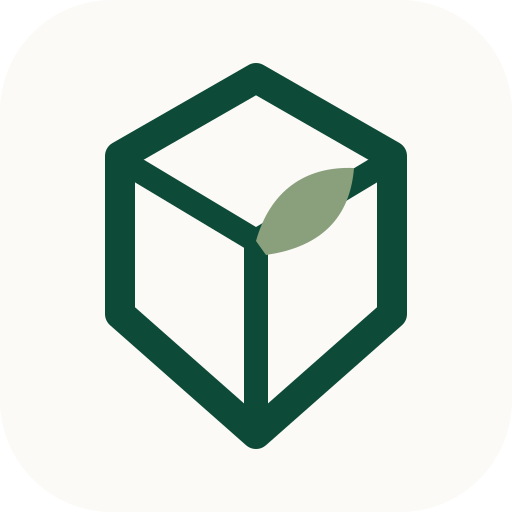
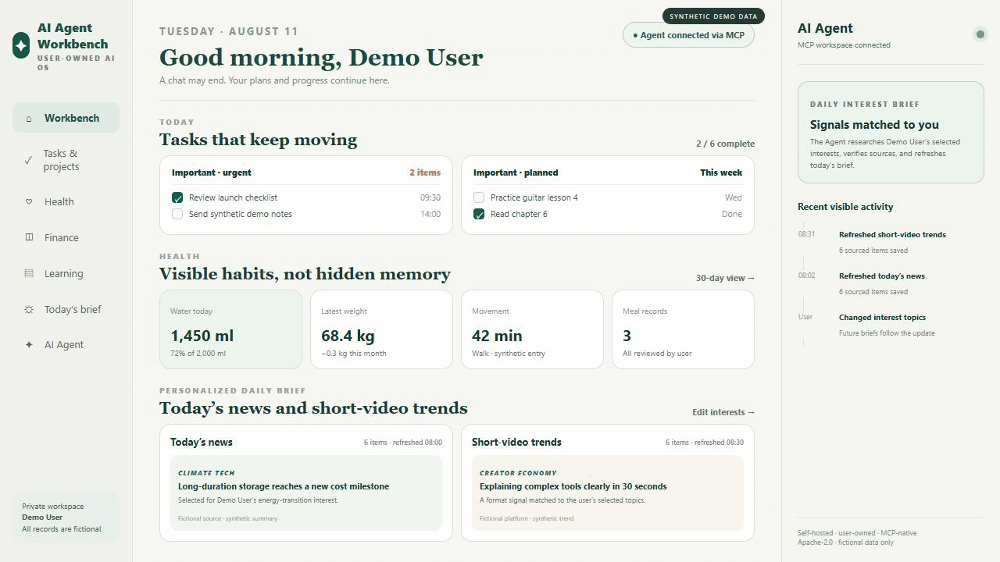
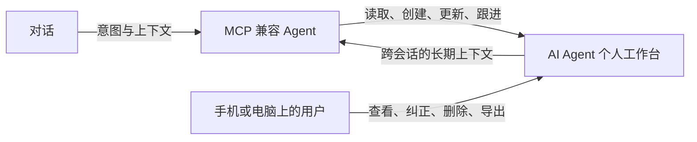
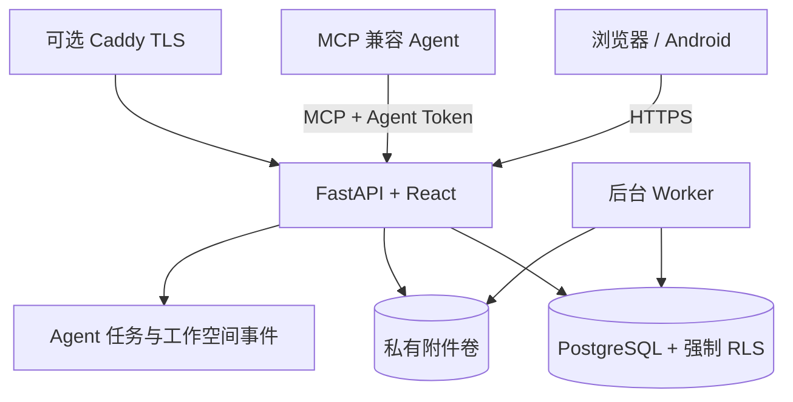

<div align="center">
  
  <h1>AI Agent 个人工作台</h1>
  <p><strong>对话会结束，但你的生活不会重置。</strong></p>
  <p>让你的 Agent 记住你走过的每一步，也陪你走好接下来的每一步。</p>
  <p><a href="README.md">English</a> · 自托管 · 用户拥有 · MCP 原生 · Apache-2.0</p>
</div>

AI Agent 个人工作台是用户与 AI Agent 共同使用的长期记录、行动系统和用户可见控制台。它让你的 Agent 不只会聊天，还能在你授权的范围内记住、分析并持续为你行动。任务、学习、健康、财务、书影音与成长经历会沉淀为用户看得见、能修改、能删除、可导出、真正属于自己的长期记录；兼容的 Agent 可以通过 MCP 持续读取、更新和跟进。



> 演示只使用虚构用户与合成数据；本项目不会把任何真实部署当作公开 Demo。

第一次安装请先看[《发行版安装指南》](docs/RELEASE_INSTALL.zh-CN.md)，需要完整功能说明时再阅读[《中文安装与使用说明书》](docs/USER_GUIDE.zh-CN.md)。说明书集中介绍电脑本地、手机、通用 Agent、Hermes、HTTPS 部署、升级备份和常见故障，并明确区分“只使用工作台”和“工作台 + Agent”。

## 三分钟快速开始

需要 Docker Engine（含 Compose v2）以及用于生成本地随机密钥的 Python 3.10+。

```bash
git clone https://github.com/theonlymoon919/ai-agent-personal-workbench.git
cd ai-agent-personal-workbench
python scripts/generate_env.py
docker compose up -d --build
```

打开 [http://localhost:8787](http://localhost:8787)。空数据库会进入一次性的首位管理员初始化页，由你自行设置用户名、昵称和密码。初始化成功后，该入口永久关闭。

管理员可在“我的 → 账号与 AI Agent”生成一次性邀请；其他用户使用邀请自行注册。每位用户都可生成自己的 Agent Token，并在同一位置复制 MCP 地址。

可下载的预发布安装版见 [GitHub Releases](https://github.com/theonlymoon919/ai-agent-personal-workbench/releases)；预构建 GHCR 镜像和 Ubuntu HTTPS 部署见[部署文档](docs/deployment.md)。

## 接入 AI Agent

标准 MCP Streamable HTTP 入口：

```text
https://workbench.example.com/mcp/
Authorization: Bearer <该用户只显示一次的 Agent Token>
```

令牌只对应一个工作空间，工具不能通过传入其他用户 ID 跨租户。请把 Token 保存在 Agent 的私密环境或 Secret Store 中，不要写进源码、聊天记录或截图。参见 [Agent 接入](docs/agent-integration.md)和 [Hermes 参考接入](docs/integrations/hermes.md)。

## 为什么普通 Agent Memory 不够

普通聊天记忆往往对用户不可见、难以纠正、绑定某个平台或单次会话，也不适合承载长期行动。用户需要的是一份自己能审阅、修正、导出和删除的记录。AI Agent 个人工作台让“用户、Agent、长期数据”之间的关系变得明确：



真实使用方式包括：在聊天中记录饮食和运动；让 Agent 自动创建分阶段学习计划；更换会话后继续读取和跟进既有任务；用户在手机或电脑上纠正 Agent 写错的记录。

## 已有能力

- 任务、项目、阶段、四象限、重复事项和年/月/周/日历。
- 体重、饮水、饮食与运动图片、逐条分析、全天总结、长期图表、筛选、分页、回收站与恢复。
- 学习计划编辑/删除/恢复、课程、资料、进度，以及书籍、电影、纪录片、讨论与整理笔记。
- 财务账户、分类、收入、支出、转账、退款、预算、储蓄目标、周期规则、汇总、归档和习惯建议。
- 可修改的个人关注方向、今日资讯、短视频热点、来源链接和媒体信息。
- 邀请注册、密码和用户名修改、Agent Token 轮换、数据导出与账号彻底删除。
- MCP 工具、Agent 任务队列、审计、实时刷新、私有附件、PostgreSQL RLS 与 Android 壳应用。
- 可选的 Hermes 参考安装器：常驻聊天技能、附件路径交接、幂等健康图片上传桥接和稳定目录后台连接器。

## 多租户与隐私模型

每个账号拥有一个独立工作空间。租户表强制启用 PostgreSQL 行级安全，应用在每个事务内设置工作空间上下文；附件键绑定工作空间；凭据无法选择其他租户。密码采用 Argon2，登录会话与 Agent Token 相互独立，Token 在数据库中只保存带 pepper 的摘要。

程序镜像、PostgreSQL 数据、私有附件和 HTTPS 状态使用不同卷。详细威胁边界、备份配对、导出与删除机制见[隐私与安全](docs/privacy-and-security.md)。

## 架构与文档



- [完整架构](ARCHITECTURE.md)
- [中文安装与使用说明书](docs/USER_GUIDE.zh-CN.md)
- [快速开始](docs/quick-start.md)
- [Linux、HTTPS、源码构建与 GHCR](docs/deployment.md)
- [Agent / MCP 接入](docs/agent-integration.md)
- [隐私与安全](docs/privacy-and-security.md)
- [Android 构建与安装](docs/android.md)

## 备份、导出与恢复

升级前必须同时备份 PostgreSQL 与私有附件卷。Linux 部署附带 restic 定时备份脚本；用户也可以从页面导出自己的结构化数据。数据库恢复和附件恢复必须来自同一恢复点，详见[部署文档](docs/deployment.md#backup-export-and-recovery)。

## 当前限制

- 当前是 Alpha 版，升级前务必备份。
- 每个工作空间当前只允许一个有效 Agent Token；轮换后旧 Token 立即失效。
- 项目不内置微信、飞书或 QQ 连接器；已经接入这些渠道的 Agent 可以再通过 MCP 使用工作台。
- Android 进程存活时可通知；被强制结束后的可靠推送需要部署者自行配置厂商通道。
- 财务建议只面向个人习惯，不构成投资、税务、法律或会计建议。
- 通用 MCP 已用 Python MCP SDK 做自动化验证，不同 Agent 产品仍可能需要各自的配置格式。

## Roadmap

- 版本化恢复工具与对象存储备份目标。
- 更多 MCP 客户端兼容性自动测试。
- 维护者签名 Android Release 与可验证产物来源。
- 不依赖真实部署压缩包的安全导入器。
- 无障碍、多语言与低资源部署优化。

## 开发、测试与贡献

```bash
python -m venv .venv
./.venv/bin/pip install -r backend/requirements.txt
./.venv/bin/python -m unittest discover -s backend/tests -v
cd frontend && npm ci && npm test && npm run build
```

Android、Docker、隐私扫描和提交要求见 [CONTRIBUTING.md](CONTRIBUTING.md)。禁止在代码、测试、截图、Issue 或日志中放入真实用户数据与凭据。安全问题请依据 [SECURITY.md](SECURITY.md) 私下报告。

## License

本项目使用 [Apache License 2.0](LICENSE)，另见 [NOTICE](NOTICE)。
